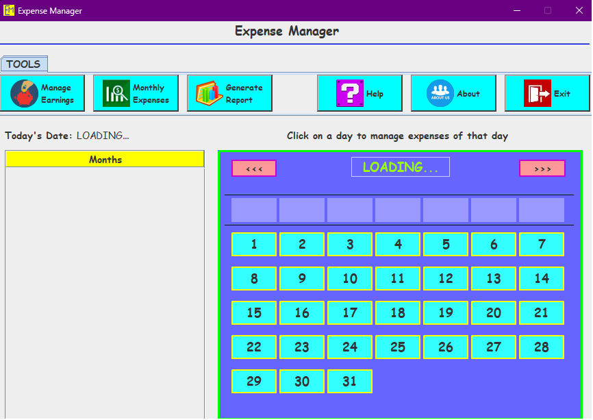

## To run

- install java
- install mysql server
- install jdbc , jdbc mysql at 3306
- install netbeans
- clone and open in netbeans , build
- run jar file

java -jar "Expense Manager.jar" 

## Snips
 

